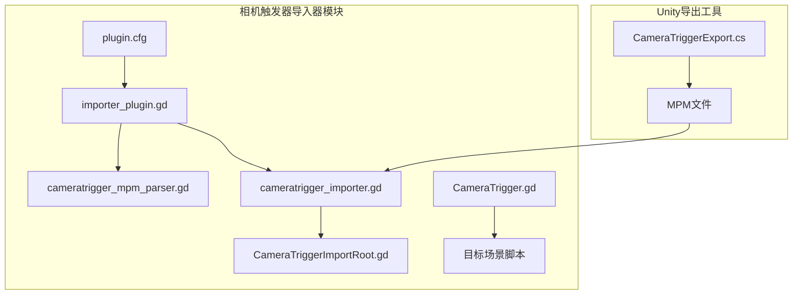
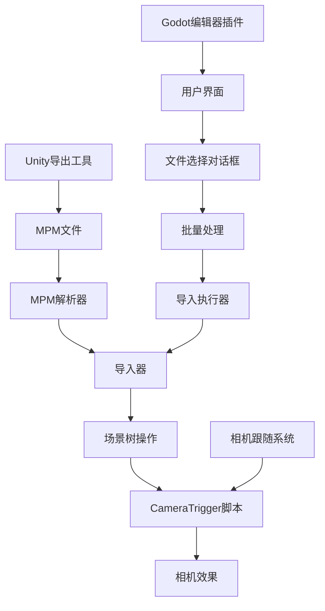
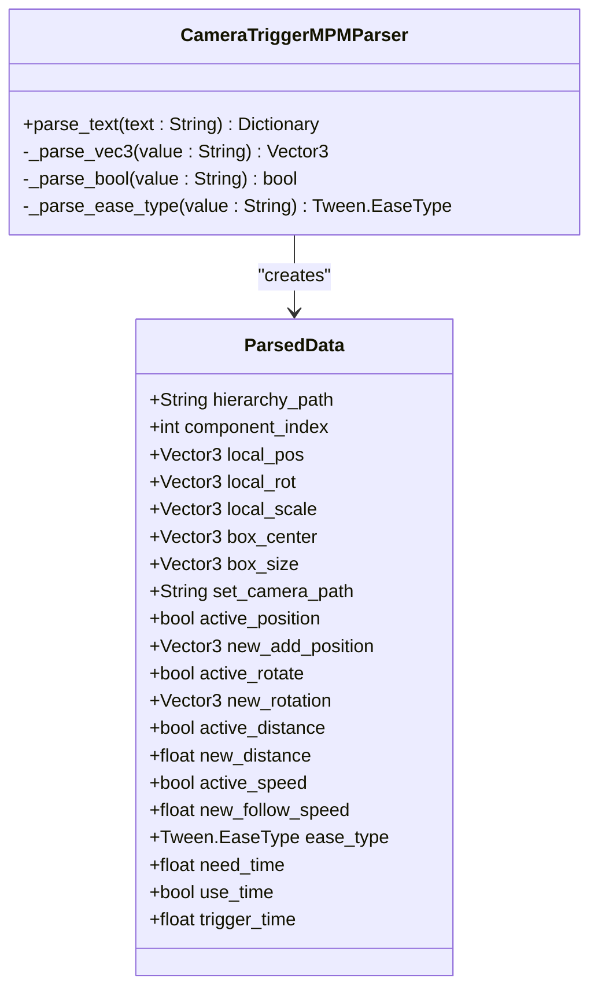
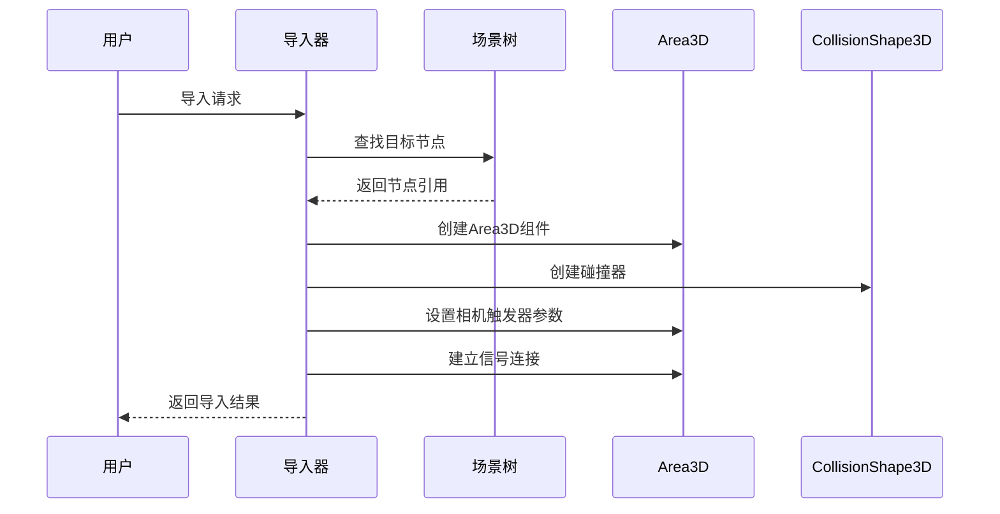
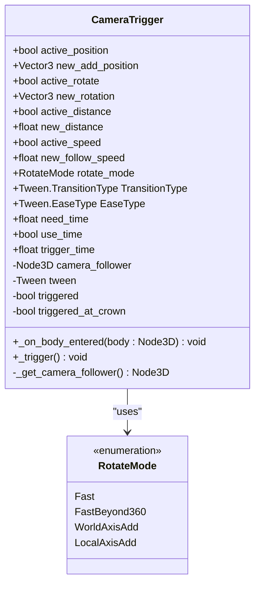
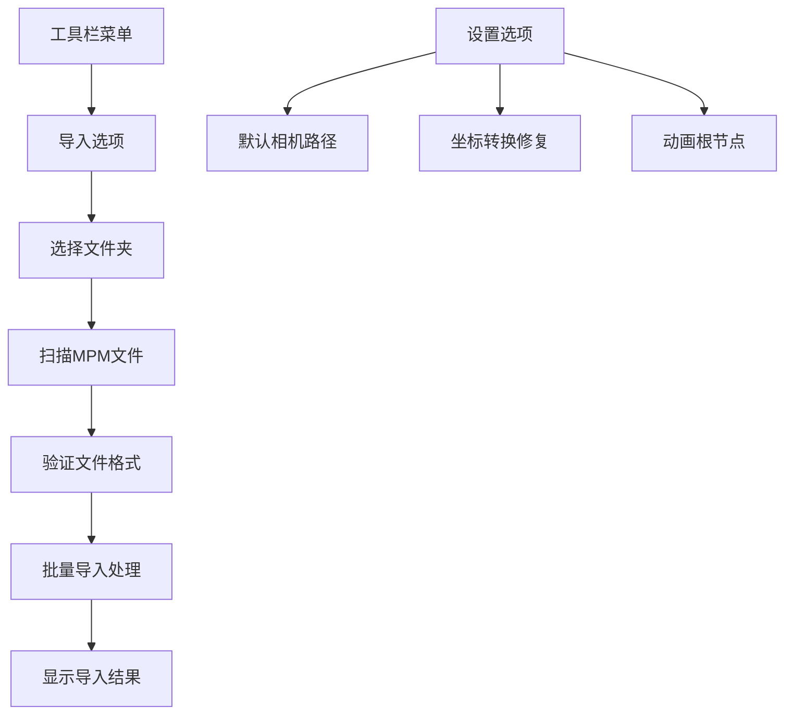
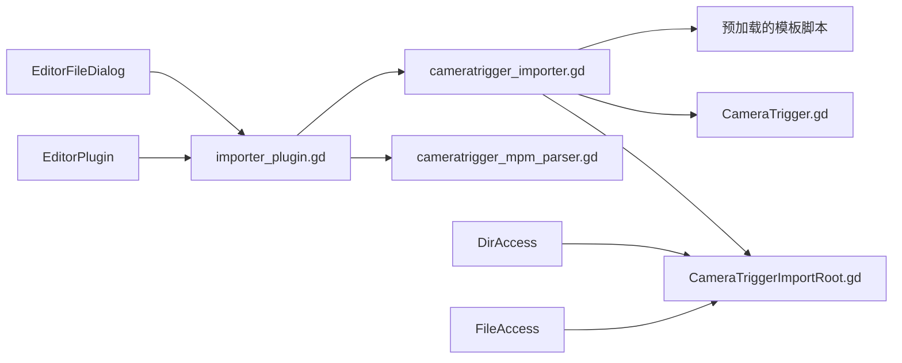

# 相机触发器导入器

<cite>
**本文档引用的文件**
- [cameratrigger_importer.gd](file://addons/mpm_importer/cameratrigger_importer.gd)
- [cameratrigger_mpm_parser.gd](file://addons/mpm_importer/cameratrigger_mpm_parser.gd)
- [CameraTriggerImportRoot.gd](file://addons/mpm_importer/CameraTriggerImportRoot.gd)
- [importer_plugin.gd](file://addons/mpm_importer/importer_plugin.gd)
- [plugin.cfg](file://addons/mpm_importer/plugin.cfg)
- [CameraTrigger.gd](file://#Template/[Scripts]/CameraScripts/CameraTrigger.gd)
- [CameraTriggerExport.cs](file://#Template/[Scripts]/PortTookits/Editor/CameraTriggerExport.cs)
</cite>

## 目录
1. [简介](#简介)
2. [项目结构](#项目结构)
3. [核心组件](#核心组件)
4. [架构概览](#架构概览)
5. [详细组件分析](#详细组件分析)
6. [依赖关系分析](#依赖关系分析)
7. [性能考虑](#性能考虑)
8. [故障排除指南](#故障排除指南)
9. [结论](#结论)

## 简介

相机触发器导入器是Godot引擎中的一个专用插件，用于将Unity引擎中导出的相机触发器数据导入到Godot项目中。该插件基于MPM（Multi-Platform Module）文件格式，支持将Unity中的相机触发器组件转换为Godot中的CameraTrigger脚本，实现跨平台的关卡数据迁移。

该插件的主要功能包括：
- 解析Unity导出的MPM文件格式
- 将相机触发器数据映射到Godot场景树
- 自动创建和配置Area3D碰撞器
- 应用相机跟随参数和动画效果
- 支持批量导入多个相机触发器

## 项目结构

相机触发器导入器位于Godot项目的`addons/mpm_importer/`目录下，采用模块化设计，包含以下主要组件：

**图表来源**
- [plugin.cfg:1-8](file://addons/mpm_importer/plugin.cfg#L1-L8)
- [importer_plugin.gd:1-218](file://addons/mpm_importer/importer_plugin.gd#L1-L218)

**章节来源**
- [plugin.cfg:1-8](file://addons/mpm_importer/plugin.cfg#L1-L8)
- [importer_plugin.gd:1-218](file://addons/mpm_importer/importer_plugin.gd#L1-L218)

## 核心组件

相机触发器导入器由四个核心组件构成，每个组件都有特定的功能职责：

### 1. MPM解析器 (CameraTrigger MPM Parser)
负责解析Unity导出的MPM文本文件，提取相机触发器的所有配置参数。

### 2. 导入器 (CameraTrigger Importer)
将解析后的数据应用到Godot场景中，创建和配置相应的节点和组件。

### 3. 导入根节点 (CameraTriggerImportRoot)
提供用户界面接口，允许开发者通过文件对话框选择要导入的文件夹。

### 4. 插件入口 (importer_plugin.gd)
Godot编辑器插件的主入口点，提供工具栏菜单和全局导入功能。

**章节来源**
- [cameratrigger_mpm_parser.gd:1-73](file://addons/mpm_importer/cameratrigger_mpm_parser.gd#L1-L73)
- [cameratrigger_importer.gd:1-279](file://addons/mpm_importer/cameratrigger_importer.gd#L1-L279)
- [CameraTriggerImportRoot.gd:1-78](file://addons/mpm_importer/CameraTriggerImportRoot.gd#L1-L78)
- [importer_plugin.gd:1-218](file://addons/mpm_importer/importer_plugin.gd#L1-L218)

## 架构概览

相机触发器导入器采用分层架构设计，确保代码的可维护性和扩展性：

**图表来源**
- [importer_plugin.gd:19-85](file://addons/mpm_importer/importer_plugin.gd#L19-L85)
- [CameraTrigger.gd:1-109](file://#Template/[Scripts]/CameraScripts/CameraTrigger.gd#L1-L109)

### 数据流处理流程

相机触发器导入过程涉及以下关键步骤：

1. **文件发现**: 扫描指定文件夹中的所有`.mpm`文件
2. **内容解析**: 使用MPM解析器提取配置参数
3. **场景定位**: 通过层次路径找到目标节点
4. **组件创建**: 创建Area3D和碰撞器组件
5. **属性应用**: 设置相机触发器的所有参数
6. **连接建立**: 建立必要的信号连接

**章节来源**
- [CameraTriggerImportRoot.gd:31-75](file://addons/mpm_importer/CameraTriggerImportRoot.gd#L31-L75)
- [cameratrigger_importer.gd:6-42](file://addons/mpm_importer/cameratrigger_importer.gd#L6-L42)

## 详细组件分析

### MPM解析器组件

MPM解析器负责将Unity导出的文本格式转换为Godot可用的数据结构：

**图表来源**
- [cameratrigger_mpm_parser.gd:4-42](file://addons/mpm_importer/cameratrigger_mpm_parser.gd#L4-L42)

#### 解析算法分析

解析器采用逐行处理的方式，支持多种数据类型的自动转换：

- **字符串到向量3D**: 解析"X,Y,Z"格式的坐标数据
- **字符串到布尔值**: 支持"true/false"、"1/0"、"yes/no"等多种格式
- **字符串到Ease类型**: 自动识别缓动函数类型

**章节来源**
- [cameratrigger_mpm_parser.gd:44-73](file://addons/mpm_importer/cameratrigger_mpm_parser.gd#L44-L73)

### 导入器组件

导入器是整个系统的核心，负责将解析的数据应用到实际的Godot场景中：

**图表来源**
- [cameratrigger_importer.gd:6-42](file://addons/mpm_importer/cameratrigger_importer.gd#L6-L42)

#### 节点查找策略

导入器实现了智能的节点查找机制，支持精确匹配和模糊匹配：

1. **精确路径匹配**: 使用层次路径直接定位节点
2. **名称回退匹配**: 当路径匹配失败时，根据名称进行模糊搜索
3. **克隆标签处理**: 自动处理Unity导出时添加的"(Clone)"标签
4. **索引号移除**: 移除节点名称末尾的数字索引

**章节来源**
- [cameratrigger_importer.gd:44-133](file://addons/mpm_importer/cameratrigger_importer.gd#L44-L133)

### 相机触发器脚本

相机触发器脚本定义了相机跟随的具体行为和动画效果：

**图表来源**
- [CameraTrigger.gd:1-109](file://#Template/[Scripts]/CameraScripts/CameraTrigger.gd#L1-L109)

#### 动画过渡系统

相机触发器支持多种动画过渡效果，包括位置、旋转、距离和跟随速度的平滑过渡：

- **位置过渡**: 相机相对于目标对象的位置偏移
- **旋转过渡**: 支持多种旋转模式和角度计算
- **距离过渡**: 相机与目标对象的距离调整
- **速度过渡**: 相机跟随目标的速度变化

**章节来源**
- [CameraTrigger.gd:57-109](file://#Template/[Scripts]/CameraScripts/CameraTrigger.gd#L57-L109)

### 插件入口组件

插件入口提供了完整的用户交互界面和批量处理功能：

**图表来源**
- [importer_plugin.gd:27-85](file://addons/mpm_importer/importer_plugin.gd#L27-L85)

#### 用户界面设计

插件提供了直观的用户界面，包括：
- **工具栏菜单**: 一键访问所有导入功能
- **文件对话框**: 选择包含MPM文件的文件夹
- **节点路径对话框**: 通过场景树选择目标节点
- **状态反馈**: 实时显示导入进度和结果

**章节来源**
- [importer_plugin.gd:104-151](file://addons/mpm_importer/importer_plugin.gd#L104-L151)

## 依赖关系分析

相机触发器导入器的依赖关系相对简单，主要依赖于Godot引擎的标准库和模板系统的相机跟随功能：

**图表来源**
- [importer_plugin.gd:6-11](file://addons/mpm_importer/importer_plugin.gd#L6-L11)
- [CameraTriggerImportRoot.gd:4-5](file://addons/mpm_importer/CameraTriggerImportRoot.gd#L4-L5)

### 外部依赖

系统对外部依赖的管理：
- **Godot引擎**: 依赖Godot 4.6+的编辑器API
- **模板系统**: 依赖项目中的CameraTrigger模板脚本
- **Unity导出工具**: 依赖Unity中的CameraTriggerExport.cs工具

**章节来源**
- [importer_plugin.gd:1-218](file://addons/mpm_importer/importer_plugin.gd#L1-L218)
- [CameraTriggerImportRoot.gd:1-78](file://addons/mpm_importer/CameraTriggerImportRoot.gd#L1-L78)

## 性能考虑

相机触发器导入器在设计时考虑了以下性能优化：

### 内存管理
- 使用`RefCounted`基类确保适当的内存管理
- 避免不必要的对象创建和复制
- 及时清理临时变量和数组

### 文件I/O优化
- 批量处理多个MPM文件，减少磁盘访问次数
- 使用`DirAccess`和`FileAccess`进行高效的文件操作
- 实现错误处理以避免重复的文件读取尝试

### 场景树操作优化
- 使用`get_node_or_null`避免异常处理开销
- 实现智能的节点查找策略，减少遍历次数
- 批量应用属性变更，减少场景更新频率

## 故障排除指南

### 常见问题及解决方案

#### 1. 节点未找到错误
**症状**: 导入过程中出现"Missing node"错误
**原因**: MPM文件中的层次路径在当前场景中不存在
**解决方案**: 
- 检查Unity场景中的节点层级是否正确导出
- 确保场景树结构与Unity导出时一致
- 使用名称回退机制，检查节点名称是否发生变化

#### 2. 相机跟随参数不生效
**症状**: 导入后相机跟随效果不符合预期
**原因**: 相机跟随节点路径配置错误
**解决方案**:
- 检查`default_set_camera`路径设置
- 确认相机跟随节点存在且可访问
- 验证坐标转换设置是否正确

#### 3. 碰撞器配置问题
**症状**: 相机触发器无法正常检测玩家进入
**原因**: BoxCollider配置不正确
**解决方案**:
- 检查BoxCollider的center和size参数
- 确保碰撞器与场景中的玩家模型匹配
- 验证碰撞器的父子关系设置

#### 4. 导入进度显示问题
**症状**: 导入完成后没有显示统计信息
**原因**: 编辑器输出窗口被其他内容覆盖
**解决方案**:
- 切换到编辑器的输出面板
- 检查是否有错误信息阻止了结果显示
- 重新运行导入操作

**章节来源**
- [cameratrigger_importer.gd:14-30](file://addons/mpm_importer/cameratrigger_importer.gd#L14-L30)
- [CameraTriggerImportRoot.gd:72-75](file://addons/mpm_importer/CameraTriggerImportRoot.gd#L72-L75)

## 结论

相机触发器导入器是一个功能完整、设计合理的Godot插件，成功实现了Unity到Godot的相机触发器数据迁移。该插件的主要优势包括：

### 技术优势
- **模块化设计**: 清晰的分层架构便于维护和扩展
- **智能匹配**: 支持精确和模糊的节点查找机制
- **批量处理**: 高效处理多个MPM文件的导入
- **错误处理**: 完善的错误报告和恢复机制

### 使用价值
- **跨平台兼容**: 支持Unity和Godot之间的数据交换
- **自动化程度高**: 减少手动配置的工作量
- **灵活性强**: 支持自定义相机跟随参数和动画效果
- **易于集成**: 与现有的Godot模板系统无缝集成

### 发展前景
该插件为Godot游戏开发提供了重要的工具链支持，特别是在需要从Unity迁移项目的场景中具有重要价值。未来可以考虑添加更多的相机效果类型和更高级的配置选项。