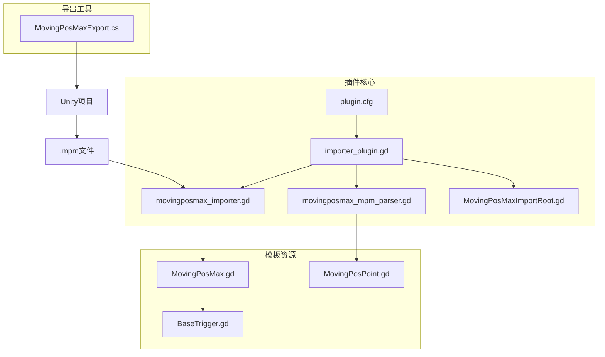
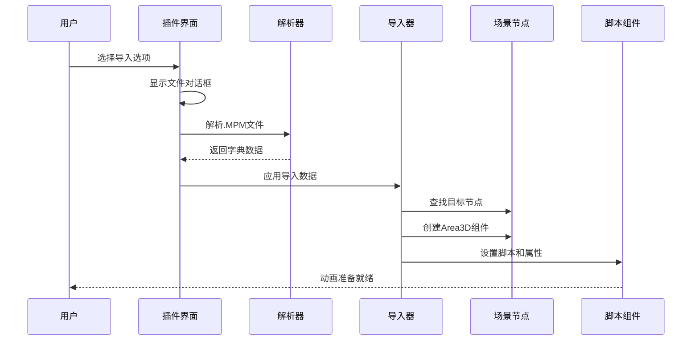
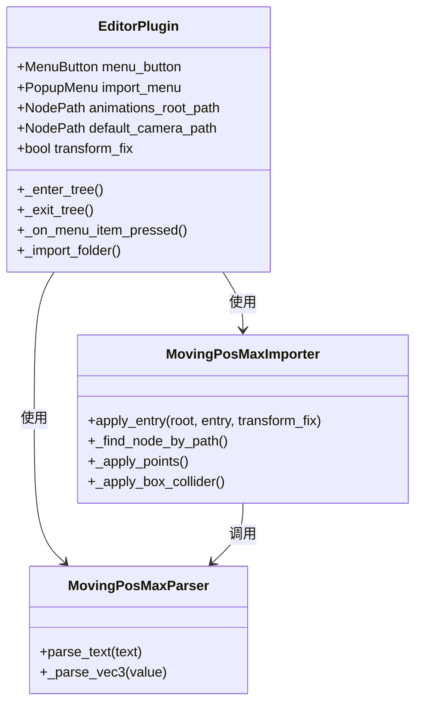
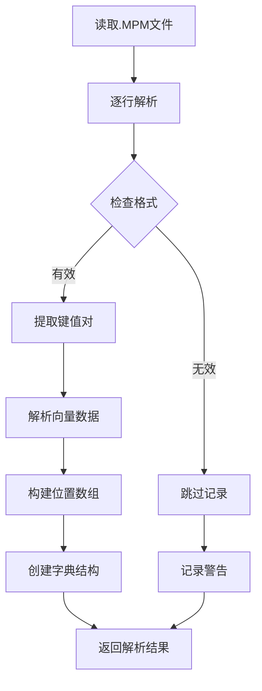
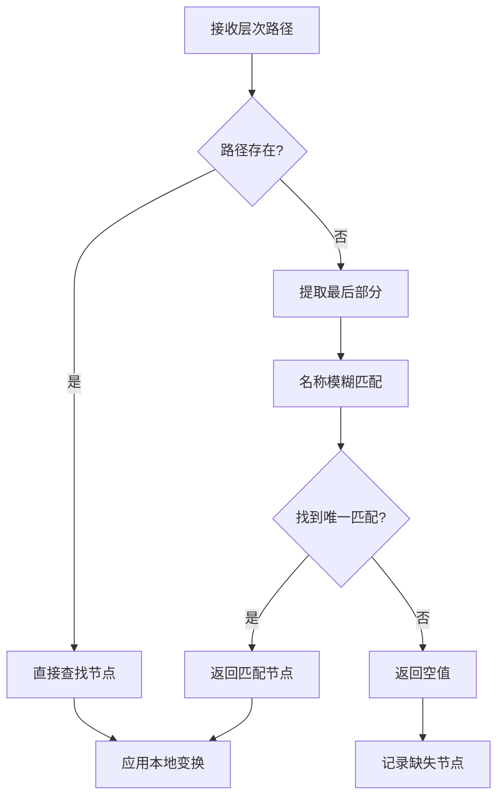
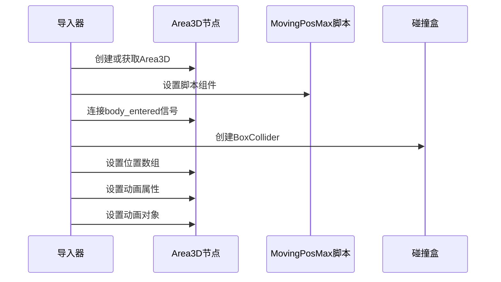
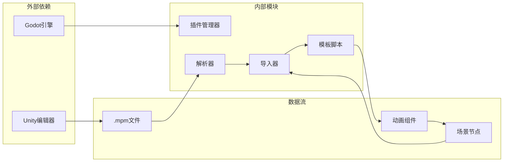

# 移动位置最大值导入器

<cite>
**本文档引用的文件**
- [plugin.cfg](file://addons/mpm_importer/plugin.cfg)
- [importer_plugin.gd](file://addons/mpm_importer/importer_plugin.gd)
- [movingposmax_importer.gd](file://addons/mpm_importer/movingposmax_importer.gd)
- [movingposmax_mpm_parser.gd](file://addons/mpm_importer/movingposmax_mpm_parser.gd)
- [MovingPosMaxImportRoot.gd](file://addons/mpm_importer/MovingPosMaxImportRoot.gd)
- [MovingPosMax.gd](file://#Template/[Scripts]/Animator/MovingPosMax.gd)
- [MovingPosPoint.gd](file://addons/mpm_importer/MovingPosPoint.gd)
- [BaseTrigger.gd](file://#Template/[Scripts]/Trigger/BaseTrigger.gd)
- [MovingPosMaxExport.cs](file://#Template/[Scripts]/PortTookits/Editor/MovingPosMaxExport.cs)
- [project.godot](file://project.godot)
- [README.md](file://README.md)
</cite>

## 目录
1. [简介](#简介)
2. [项目结构](#项目结构)
3. [核心组件](#核心组件)
4. [架构概览](#架构概览)
5. [详细组件分析](#详细组件分析)
6. [依赖关系分析](#依赖关系分析)
7. [性能考虑](#性能考虑)
8. [故障排除指南](#故障排除指南)
9. [结论](#结论)

## 简介

移动位置最大值导入器（MovingPosMax Importer）是一个专为Godot引擎设计的插件系统，用于从Unity项目中导入MovingPosMax组件数据。该系统实现了完整的数据导入流程，包括文件解析、节点匹配、属性应用和动画配置。

该插件支持将Unity中的MovingPosMax组件（包含路径点序列、移动时间、等待时间等参数）转换为Godot中的可执行动画系统，特别适用于Dancing Line风格的游戏开发。

## 项目结构

移动位置最大值导入器位于`addons/mpm_importer/`目录下，采用模块化设计，包含以下主要组件：

**图表来源**
- [plugin.cfg:1-8](file://addons/mpm_importer/plugin.cfg#L1-L8)
- [importer_plugin.gd:1-218](file://addons/mpm_importer/importer_plugin.gd#L1-L218)
- [movingposmax_importer.gd:1-349](file://addons/mpm_importer/movingposmax_importer.gd#L1-L349)

**章节来源**
- [plugin.cfg:1-8](file://addons/mpm_importer/plugin.cfg#L1-L8)
- [project.godot:29-31](file://project.godot#L29-L31)

## 核心组件

### 插件入口点

插件通过`plugin.cfg`配置文件注册，在编辑器中提供用户界面和导入功能。

### 解析器组件

- **MovingPosMax MPM解析器**: 将Unity导出的文本格式数据转换为Godot可用的字典结构
- **通用MPM解析器**: 提供基础的键值对解析功能

### 导入器组件

- **MovingPosMax导入器**: 负责将解析后的数据应用到Godot场景中
- **节点查找器**: 实现智能的节点路径解析和模糊匹配
- **属性应用器**: 处理变换、碰撞盒、动画对象等属性设置

**章节来源**
- [importer_plugin.gd:6-11](file://addons/mpm_importer/importer_plugin.gd#L6-L11)
- [movingposmax_mpm_parser.gd:4-44](file://addons/mpm_importer/movingposmax_mpm_parser.gd#L4-L44)
- [movingposmax_importer.gd:7-39](file://addons/mpm_importer/movingposmax_importer.gd#L7-L39)

## 架构概览

该系统采用分层架构设计，实现了清晰的职责分离：

**图表来源**
- [importer_plugin.gd:153-212](file://addons/mpm_importer/importer_plugin.gd#L153-L212)
- [movingposmax_mpm_parser.gd:4-44](file://addons/mpm_importer/movingposmax_mpm_parser.gd#L4-L44)
- [movingposmax_importer.gd:7-39](file://addons/mpm_importer/movingposmax_importer.gd#L7-L39)

## 详细组件分析

### 插件管理器

插件管理器负责在Godot编辑器中注册和管理所有导入功能：

**图表来源**
- [importer_plugin.gd:1-218](file://addons/mpm_importer/importer_plugin.gd#L1-L218)
- [movingposmax_importer.gd:1-349](file://addons/mpm_importer/movingposmax_importer.gd#L1-L349)
- [movingposmax_mpm_parser.gd:1-55](file://addons/mpm_importer/movingposmax_mpm_parser.gd#L1-L55)

### 数据解析流程

解析器组件实现了从Unity导出格式到Godot内部表示的转换：

**图表来源**
- [movingposmax_mpm_parser.gd:4-44](file://addons/mpm_importer/movingposmax_mpm_parser.gd#L4-L44)

### 节点匹配算法

导入器实现了智能的节点查找和匹配机制：

**图表来源**
- [movingposmax_importer.gd:41-130](file://addons/mpm_importer/movingposmax_importer.gd#L41-L130)

### 动画属性应用

导入器负责将所有动画相关属性应用到目标节点：

**图表来源**
- [movingposmax_importer.gd:33-37](file://addons/mpm_importer/movingposmax_importer.gd#L33-L37)
- [movingposmax_importer.gd:222-284](file://addons/mpm_importer/movingposmax_importer.gd#L222-L284)

**章节来源**
- [importer_plugin.gd:19-102](file://addons/mpm_importer/importer_plugin.gd#L19-L102)
- [movingposmax_importer.gd:169-192](file://addons/mpm_importer/movingposmax_importer.gd#L169-L192)

## 依赖关系分析

系统采用松耦合的设计，通过接口和预加载机制实现模块间的通信：

**图表来源**
- [project.godot:17-18](file://project.godot#L17-L18)
- [MovingPosMaxExport.cs:13-82](file://#Template/[Scripts]/PortTookits/Editor/MovingPosMaxExport.cs#L13-L82)

**章节来源**
- [project.godot:29-31](file://project.godot#L29-L31)
- [MovingPosMaxExport.cs:1-121](file://#Template/[Scripts]/PortTookits/Editor/MovingPosMaxExport.cs#L1-L121)

## 性能考虑

### 内存优化策略

1. **延迟加载**: 使用`preload`机制延迟加载脚本资源
2. **批量处理**: 支持单个文件夹内的批量导入操作
3. **缓存机制**: 避免重复解析相同的数据

### 导入性能优化

1. **异步处理**: 导入过程在后台线程中执行
2. **错误恢复**: 部分文件失败不影响整体导入流程
3. **进度反馈**: 提供详细的导入状态报告

### 资源管理

1. **自动清理**: 导入完成后自动释放临时资源
2. **内存监控**: 监控大量数据导入时的内存使用情况
3. **错误隔离**: 单个文件的错误不会影响其他文件的处理

## 故障排除指南

### 常见问题及解决方案

#### 节点查找失败

**问题**: "Missing node: [路径]" 错误
**原因**: 
- 目标节点不存在或名称不匹配
- 层次路径不正确
- Unity导出时的节点结构发生变化

**解决方案**:
1. 检查Unity场景中的节点层级
2. 验证`.mpm`文件中的`hierarchy_path`字段
3. 使用模糊匹配功能进行手动调整

#### 动画对象未找到

**问题**: "Missing animated_object: [路径]" 警告
**原因**:
- 动画对象路径配置错误
- 目标节点在Godot场景中不存在

**解决方案**:
1. 确认Unity中设置的动画对象路径
2. 检查Godot场景中的节点命名一致性
3. 使用节点路径对话框重新设置

#### 坐标系统不一致

**问题**: 导入后的动画方向或位置不正确
**原因**: Unity和Godot的坐标系统差异

**解决方案**:
1. 启用"坐标转换修复"选项
2. 手动调整节点的局部变换
3. 检查Unity导出时的坐标转换设置

#### 碰撞检测问题

**问题**: 触发器无法正常工作
**原因**:
- BoxCollider尺寸设置不正确
- Area3D组件配置错误

**解决方案**:
1. 检查BoxCollider的center和size参数
2. 验证Area3D的碰撞形状配置
3. 确认触发器的one_shot和debug_mode设置

**章节来源**
- [movingposmax_importer.gd:18-31](file://addons/mpm_importer/movingposmax_importer.gd#L18-L31)
- [movingposmax_importer.gd:272-273](file://addons/mpm_importer/movingposmax_importer.gd#L272-L273)

## 结论

移动位置最大值导入器是一个功能完整、设计合理的Godot插件系统，成功实现了Unity到Godot的动画数据迁移。该系统的主要优势包括：

### 技术优势

1. **模块化设计**: 清晰的职责分离和接口定义
2. **智能匹配**: 支持模糊节点查找和路径解析
3. **错误处理**: 完善的错误检测和恢复机制
4. **性能优化**: 批量处理和内存管理优化

### 应用价值

1. **兼容性强**: 支持多种Unity导出格式和Godot版本
2. **易用性好**: 直观的编辑器界面和详细的错误提示
3. **扩展性佳**: 模块化的架构便于功能扩展和定制
4. **维护性高**: 清晰的代码结构和完善的注释说明

### 发展前景

该系统为Dancing Line风格游戏的开发提供了强有力的技术支撑，通过持续的功能增强和性能优化，有望成为Godot生态中重要的工具链组件。未来可以考虑增加更多动画类型的导入支持、改进导入效率以及增强与其他Godot工具的集成度。