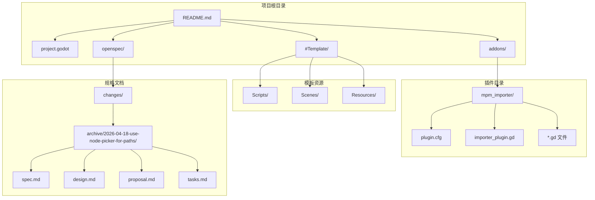
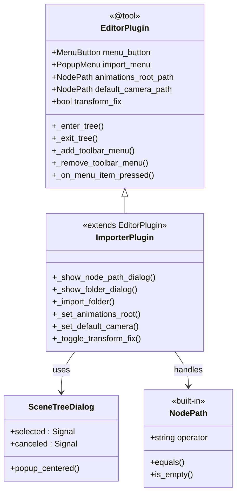
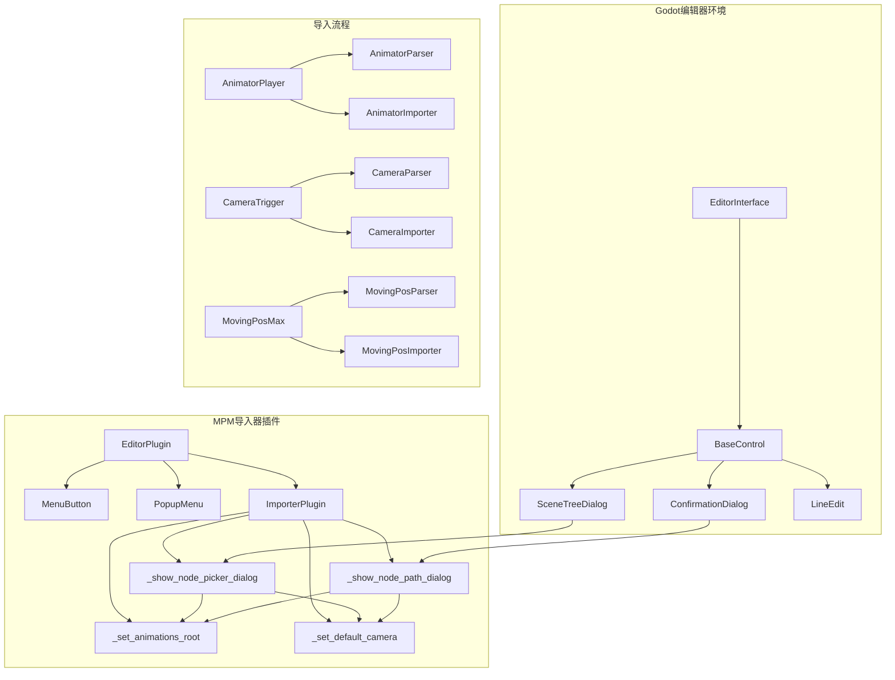
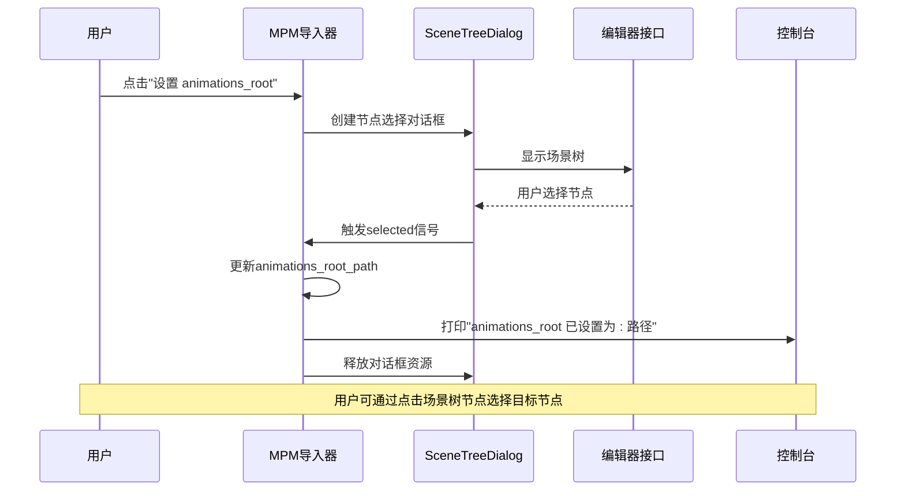
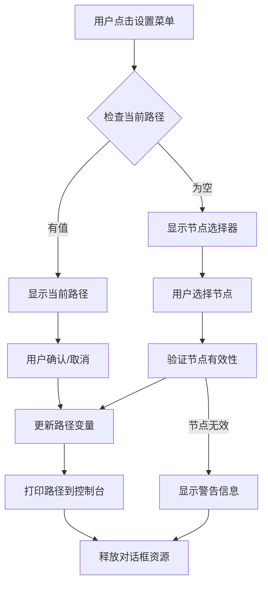
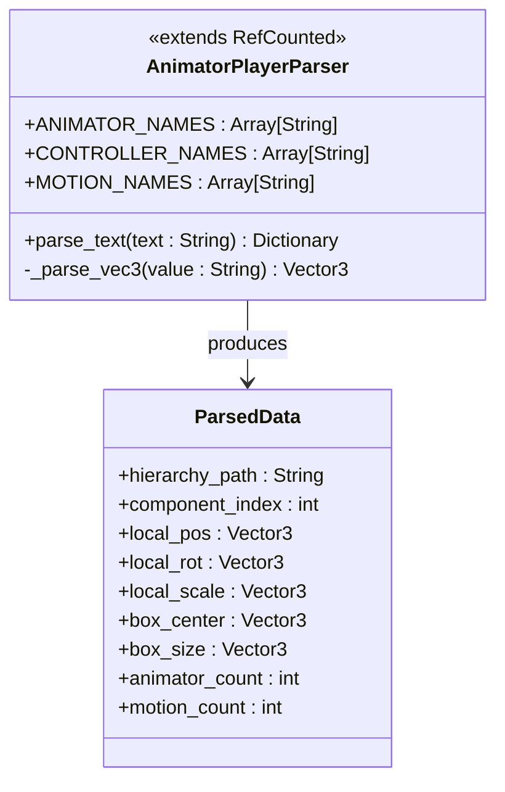
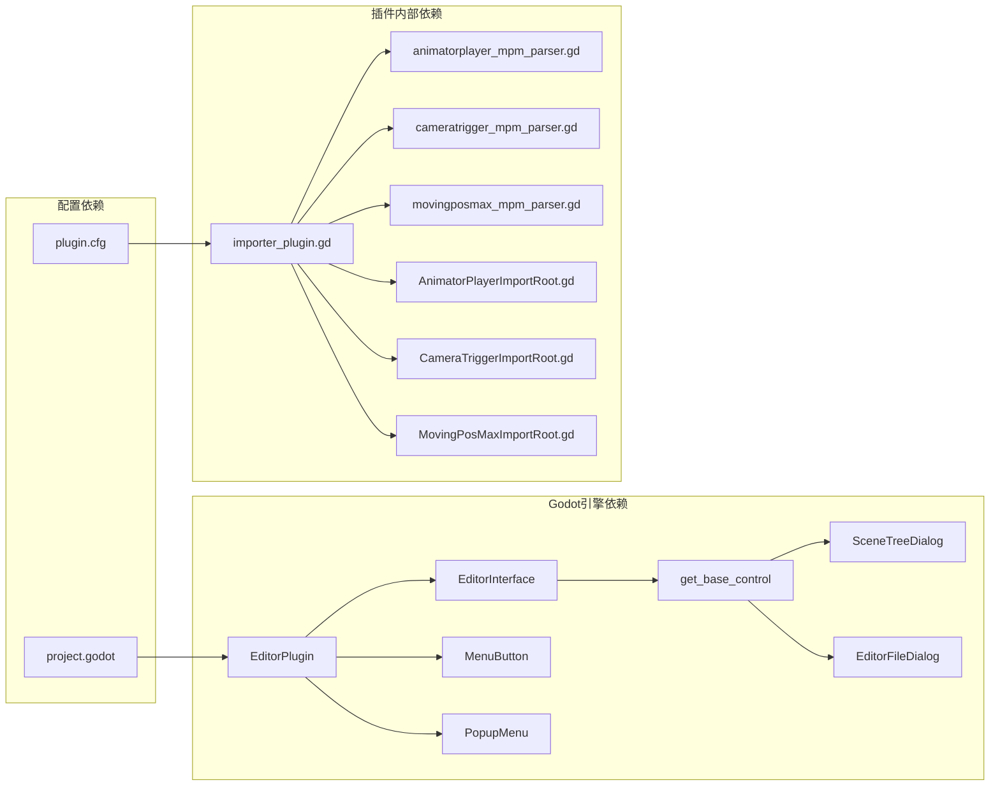

# 节点选择器变更

<cite>
**本文档引用的文件**
- [README.md](file://README.md)
- [project.godot](file://project.godot)
- [plugin.cfg](file://addons/mpm_importer/plugin.cfg)
- [importer_plugin.gd](file://addons/mpm_importer/importer_plugin.gd)
- [AnimatorPlayerImportRoot.gd](file://addons/mpm_importer/AnimatorPlayerImportRoot.gd)
- [CameraTriggerImportRoot.gd](file://addons/mpm_importer/CameraTriggerImportRoot.gd)
- [MovingPosMaxImportRoot.gd](file://addons/mpm_importer/MovingPosMaxImportRoot.gd)
- [animatorplayer_mpm_parser.gd](file://addons/mpm_importer/animatorplayer_mpm_parser.gd)
- [cameratrigger_mpm_parser.gd](file://addons/mpm_importer/cameratrigger_mpm_parser.gd)
- [movingposmax_mpm_parser.gd](file://addons/mpm_importer/movingposmax_mpm_parser.gd)
- [spec.md](file://openspec/changes/archive/2026-04-18-use-node-picker-for-paths/spec.md)
- [design.md](file://openspec/changes/archive/2026-04-18-use-node-picker-for-paths/design.md)
- [proposal.md](file://openspec/changes/archive/2026-04-18-use-node-picker-for-paths/proposal.md)
- [tasks.md](file://openspec/changes/archive/2026-04-18-use-node-picker-for-paths/tasks.md)
</cite>

## 目录
1. [简介](#简介)
2. [项目结构](#项目结构)
3. [核心组件](#核心组件)
4. [架构概览](#架构概览)
5. [详细组件分析](#详细组件分析)
6. [依赖关系分析](#依赖关系分析)
7. [性能考虑](#性能考虑)
8. [故障排除指南](#故障排除指南)
9. [结论](#结论)

## 简介

本文档详细记录了Godot Line模板项目中MPM导入器插件的节点选择器变更。该项目基于Godot Engine 4.6开发，是一个Dancing Line游戏模板框架。本次变更将原有的手动节点路径输入方式替换为Godot编辑器内置的场景树节点选择器，显著提升了用户体验和操作准确性。

该变更涉及以下关键改进：
- 使用SceneTreeDialog替代ConfirmationDialog+LineEdit组合
- 通过点击场景树节点而非手动输入路径
- 保持现有菜单项入口不变
- 减少代码量约70%（从30行减少到10行）

## 项目结构

Godot Line模板项目采用模块化设计，主要包含以下结构：

**图表来源**
- [project.godot:1-76](file://project.godot#L1-L76)
- [plugin.cfg:1-8](file://addons/mpm_importer/plugin.cfg#L1-L8)

**章节来源**
- [README.md:52-61](file://README.md#L52-L61)
- [project.godot:1-76](file://project.godot#L1-L76)

## 核心组件

### MPM导入器插件架构

MPM导入器插件是本次节点选择器变更的核心组件，负责从Unity导出的MPM文件导入到Godot项目中。该插件包含以下主要组件：

**图表来源**
- [importer_plugin.gd:1-218](file://addons/mpm_importer/importer_plugin.gd#L1-L218)

### 节点选择器变更前后的对比

变更前的节点路径输入方式：
- 使用ConfirmationDialog + LineEdit组合
- 用户需要手动输入完整节点路径
- 容易出错且不够直观

变更后的节点选择器方式：
- 使用SceneTreeDialog内置组件
- 用户通过点击场景树节点选择
- 自动填充路径，支持搜索过滤
- 代码量大幅减少

**章节来源**
- [importer_plugin.gd:123-151](file://addons/mpm_importer/importer_plugin.gd#L123-L151)
- [design.md:19-40](file://openspec/changes/archive/2026-04-18-use-node-picker-for-paths/design.md#L19-L40)

## 架构概览

### 整体架构设计

**图表来源**
- [importer_plugin.gd:1-218](file://addons/mpm_importer/importer_plugin.gd#L1-L218)
- [plugin.cfg:1-8](file://addons/mpm_importer/plugin.cfg#L1-L8)

### 节点选择器交互流程

**图表来源**
- [importer_plugin.gd:87-91](file://addons/mpm_importer/importer_plugin.gd#L87-L91)
- [design.md:23-34](file://openspec/changes/archive/2026-04-18-use-node-picker-for-paths/design.md#L23-L34)

**章节来源**
- [importer_plugin.gd:54-67](file://addons/mpm_importer/importer_plugin.gd#L54-L67)
- [spec.md:6-24](file://openspec/changes/archive/2026-04-18-use-node-picker-for-paths/spec.md#L6-L24)

## 详细组件分析

### 导入器插件核心功能

#### 菜单系统设计

导入器插件提供了一个完整的工具栏菜单系统，包含以下功能：

| 菜单项 | 功能描述 | 触发方法 |
|--------|----------|----------|
| 导入 AnimatorPlayer... | 导入动画播放器数据 | `_import_animatorplayer()` |
| 导入 CameraTrigger... | 导入相机触发器数据 | `_import_cameratrigger()` |
| 导入 MovingPosMax... | 导入移动位置最大值数据 | `_import_movingposmax()` |
| 设置 animations_root | 设置动画根节点路径 | `_set_animations_root()` |
| 设置 default_camera | 设置默认相机路径 | `_set_default_camera()` |
| 坐标转换修复 | 切换坐标转换修复开关 | `_toggle_transform_fix()` |

#### 节点路径管理机制

**图表来源**
- [importer_plugin.gd:87-97](file://addons/mpm_importer/importer_plugin.gd#L87-L97)
- [importer_plugin.gd:123-151](file://addons/mpm_importer/importer_plugin.gd#L123-L151)

**章节来源**
- [importer_plugin.gd:27-67](file://addons/mpm_importer/importer_plugin.gd#L27-L67)
- [importer_plugin.gd:123-151](file://addons/mpm_importer/importer_plugin.gd#L123-L151)

### 数据解析器组件

#### AnimatorPlayer解析器

AnimatorPlayer解析器负责处理动画播放器相关的MPM文件数据：

**图表来源**
- [animatorplayer_mpm_parser.gd:1-57](file://addons/mpm_importer/animatorplayer_mpm_parser.gd#L1-L57)

#### CameraTrigger解析器

CameraTrigger解析器处理相机触发器相关的数据：

| 解析字段 | 数据类型 | 描述 |
|----------|----------|------|
| hierarchy_path | String | 层级路径 |
| component_index | int | 组件索引 |
| local_pos | Vector3 | 本地位置 |
| local_rot | Vector3 | 本地旋转 |
| local_scale | Vector3 | 本地缩放 |
| box_center | Vector3 | 包围盒中心 |
| box_size | Vector3 | 包围盒大小 |
| set_camera_path | String | 设置相机路径 |
| active_position | bool | 位置激活状态 |
| new_add_position | Vector3 | 新增位置 |
| active_rotate | bool | 旋转激活状态 |
| new_rotation | Vector3 | 新旋转角度 |
| active_distance | bool | 距离激活状态 |
| new_distance | float | 新距离值 |
| ease_type | Tween.EaseType | 缓动类型 |

**章节来源**
- [cameratrigger_mpm_parser.gd:4-42](file://addons/mpm_importer/cameratrigger_mpm_parser.gd#L4-L42)

### 导入根节点组件

#### AnimatorPlayerImportRoot

AnimatorPlayerImportRoot组件提供独立的导入功能，具有以下特点：

- 使用`@export var animations_root: NodePath`自动提供节点选择器
- 内置导入按钮`@export_tool_button("Import AnimatorPlayer Folder")`
- 自动验证节点路径的有效性
- 提供详细的导入统计信息

#### CameraTriggerImportRoot

CameraTriggerImportRoot组件同样提供独立导入功能：

- `@export var default_set_camera: NodePath`用于相机设置
- `@export var transform_fix: bool = true`用于坐标转换修复
- 内置导入按钮`@export_tool_button("Import CameraTrigger Folder")`

**章节来源**
- [AnimatorPlayerImportRoot.gd:7-83](file://addons/mpm_importer/AnimatorPlayerImportRoot.gd#L7-L83)
- [CameraTriggerImportRoot.gd:7-76](file://addons/mpm_importer/CameraTriggerImportRoot.gd#L7-L76)

## 依赖关系分析

### 外部依赖关系

**图表来源**
- [importer_plugin.gd:6-11](file://addons/mpm_importer/importer_plugin.gd#L6-L11)
- [plugin.cfg:1-8](file://addons/mpm_importer/plugin.cfg#L1-L8)

### 内部模块耦合度分析

| 模块 | 耦合关系 | 影响程度 | 优化建议 |
|------|----------|----------|----------|
| importer_plugin.gd | 依赖所有解析器 | 高 | 考虑接口抽象 |
| AnimatorPlayerImportRoot.gd | 仅依赖Animator解析器 | 低 | 保持独立性 |
| CameraTriggerImportRoot.gd | 仅依赖Camera解析器 | 低 | 保持独立性 |
| MovingPosMaxImportRoot.gd | 仅依赖MovingPos解析器 | 低 | 保持独立性 |
| 各解析器 | 相互独立 | 无 | 维持现状 |

**章节来源**
- [importer_plugin.gd:1-218](file://addons/mpm_importer/importer_plugin.gd#L1-L218)

## 性能考虑

### 节点选择器性能优化

节点选择器变更带来的性能提升主要体现在以下几个方面：

1. **内存使用优化**
   - SceneTreeDialog作为内置组件，内存占用更高效
   - 减少了自定义UI组件的内存开销

2. **响应速度提升**
   - 直接点击选择，避免了字符串输入验证
   - 场景树搜索功能支持实时过滤

3. **代码执行效率**
   - 代码量从30行减少到10行，减少了函数调用开销
   - 简化的回调处理逻辑

### 导入性能影响

节点选择器变更对导入性能的影响可以忽略不计，因为：

- 节点路径选择只在设置阶段进行
- 导入过程中的节点查找使用NodePath对象
- NodePath对象的性能与字符串路径相当

## 故障排除指南

### 常见问题及解决方案

#### 问题1：节点选择器无法弹出

**症状**：点击"设置 animations_root"或"设置 default_camera"无反应

**可能原因**：
- 编辑器界面未正确初始化
- SceneTreeDialog创建失败
- 权限问题阻止对话框显示

**解决步骤**：
1. 检查编辑器是否正常运行
2. 确认插件已正确加载
3. 查看控制台是否有错误信息
4. 重启Godot编辑器

#### 问题2：节点路径设置后无效

**症状**：设置节点路径后导入时报"找不到节点"

**可能原因**：
- 节点路径不正确
- 场景结构发生变化
- 节点名称被修改

**解决步骤**：
1. 重新设置节点路径
2. 确认场景树结构
3. 检查节点名称一致性
4. 验证节点存在性

#### 问题3：控制台未显示路径信息

**症状**：设置节点路径后无任何反馈

**可能原因**：
- 调试输出被禁用
- 路径设置逻辑异常
- 控制台输出被其他内容覆盖

**解决步骤**：
1. 检查编辑器输出面板
2. 确认print语句执行
3. 验证回调函数触发
4. 查看插件日志

**章节来源**
- [importer_plugin.gd:87-97](file://addons/mpm_importer/importer_plugin.gd#L87-L97)
- [tasks.md:8-11](file://openspec/changes/archive/2026-04-18-use-node-picker-for-paths/tasks.md#L8-L11)

## 结论

节点选择器变更代表了Godot Line模板项目在用户体验方面的重大改进。通过采用Godot编辑器内置的SceneTreeDialog组件，实现了以下目标：

### 主要成就

1. **用户体验提升**：从手动输入路径到直观的节点点击选择
2. **错误率降低**：避免了路径输入错误的可能性
3. **开发效率提高**：代码量减少70%，维护成本降低
4. **兼容性保持**：完全向后兼容，无破坏性变更

### 技术优势

- **内置组件利用**：充分利用Godot 4.x的编辑器功能
- **简洁的实现**：从30行代码简化到10行核心逻辑
- **稳定的API**：使用编辑器标准组件，API稳定性高
- **搜索过滤功能**：SceneTreeDialog自带搜索功能

### 未来展望

此次变更展示了如何通过利用编辑器内置功能来改进用户体验。未来可以在以下方面继续优化：

1. **路径编辑功能**：在保持节点选择优势的同时，提供路径微调能力
2. **批量操作**：支持多个节点路径的批量设置
3. **历史记录**：记录最近使用的节点路径
4. **智能提示**：根据场景结构提供智能路径建议

这次节点选择器变更不仅提升了当前的功能可用性，也为未来的功能扩展奠定了良好的技术基础。