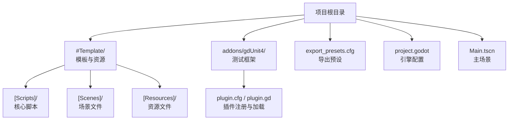
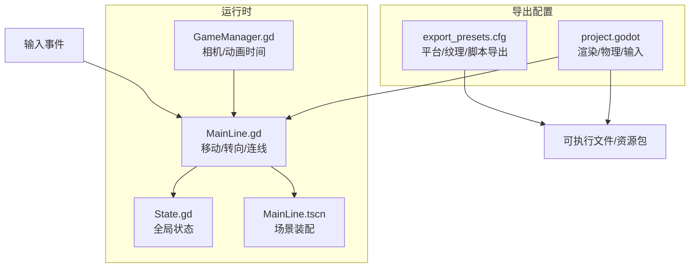
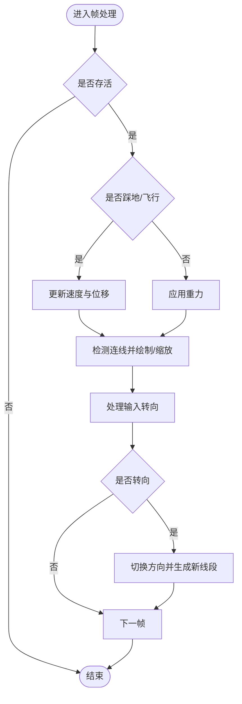
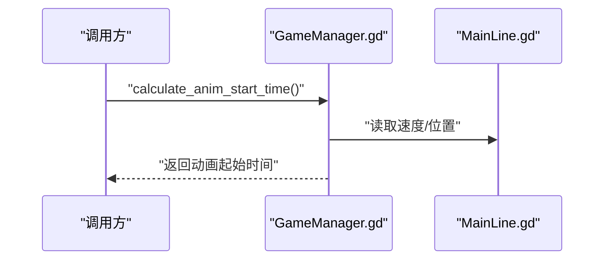
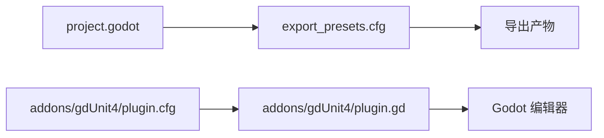

# 部署指南

<cite>
**本文引用的文件**
- [export_presets.cfg](file://export_presets.cfg)
- [project.godot](file://project.godot)
- [README.md](file://README.md)
- [CONTRIBUTING.md](file://CONTRIBUTING.md)
- [addons/gdUnit4/plugin.cfg](file://addons/gdUnit4/plugin.cfg)
- [addons/gdUnit4/plugin.gd](file://addons/gdUnit4/plugin.gd)
- [MainLine.gd](file://#Template/[Scripts]/MainLine.gd)
- [GameManager.gd](file://#Template/[Scripts]/GameManager.gd)
- [State.gd](file://#Template/[Scripts]/State.gd)
- [MainLine.tscn](file://#Template/MainLine.tscn)
</cite>

## 目录
1. [简介](#简介)
2. [项目结构](#项目结构)
3. [核心组件](#核心组件)
4. [架构总览](#架构总览)
5. [详细组件分析](#详细组件分析)
6. [依赖关系分析](#依赖关系分析)
7. [性能优化配置](#性能优化配置)
8. [多平台导出配置](#多平台导出配置)
9. [打包与分发流程](#打包与分发流程)
10. [版本管理与更新机制](#版本管理与更新机制)
11. [发布前检查清单](#发布前检查清单)
12. [故障排查指南](#故障排查指南)
13. [结论](#结论)

## 简介
本指南面向使用 Godot Line 模板进行跨平台发布的开发者，覆盖多平台导出配置（Windows、Linux、macOS）、性能优化、打包与分发流程、版本管理与更新机制，以及发布前检查清单。文档以项目实际配置文件与脚本为基础，帮助你快速、稳定地完成从开发到上线的全流程。

## 项目结构
- 模板与资源：位于 #Template/ 目录，包含场景、脚本、材质、音效等。
- 测试框架：集成 gdUnit4，位于 addons/gdUnit4/，提供单元测试能力。
- 导出配置：export_presets.cfg 定义导出预设；project.godot 定义引擎配置。
- 入口场景：Main.tscn（由 README 提及）作为主场景入口。
- 核心逻辑：MainLine.gd、GameManager.gd、State.gd 等脚本构成核心玩法与状态管理。

图示来源
- [project.godot:15-88](file://project.godot#L15-L88)
- [export_presets.cfg:1-75](file://export_presets.cfg#L1-L75)
- [README.md:53-65](file://README.md#L53-L65)

章节来源
- [README.md:53-65](file://README.md#L53-L65)
- [project.godot:15-88](file://project.godot#L15-L88)
- [export_presets.cfg:1-75](file://export_presets.cfg#L1-L75)

## 核心组件
- 主角与移动：MainLine.gd 实现角色移动、转向、连线绘制、死亡粒子效果等核心逻辑。
- 游戏管理：GameManager.gd 提供相机、主线、动画起始时间计算等辅助功能。
- 全局状态：State.gd 保存跨场景的状态数据（如位置、动画时间、收集品数量等），用于重试与恢复。
- 场景装配：MainLine.tscn 定义碰撞、音频、粒子等子节点与连接。

章节来源
- [MainLine.gd:1-224](file://#Template/[Scripts]/MainLine.gd#L1-L224)
- [GameManager.gd:1-47](file://#Template/[Scripts]/GameManager.gd#L1-L47)
- [State.gd:1-23](file://#Template/[Scripts]/State.gd#L1-L23)
- [MainLine.tscn:1-68](file://#Template/MainLine.tscn#L1-L68)

## 架构总览
下图展示从用户输入到渲染管线的关键路径，以及导出配置对最终产物的影响。

图示来源
- [MainLine.gd:105-184](file://#Template/[Scripts]/MainLine.gd#L105-L184)
- [GameManager.gd:23-39](file://#Template/[Scripts]/GameManager.gd#L23-L39)
- [State.gd:1-23](file://#Template/[Scripts]/State.gd#L1-L23)
- [MainLine.tscn:36-68](file://#Template/MainLine.tscn#L36-L68)
- [export_presets.cfg:1-75](file://export_presets.cfg#L1-L75)
- [project.godot:15-88](file://project.godot#L15-L88)

## 详细组件分析

### 主角移动与连线（MainLine.gd）
- 输入处理：响应转向操作，触发旋转与位移。
- 物理与运动：基于 CharacterBody3D 的移动与重力模拟。
- 连线绘制：根据位移动态创建与缩放线段，地面阶段同步高度。
- 死亡与特效：播放音效、生成粒子碎片并施加冲量与扭矩。

图示来源
- [MainLine.gd:53-103](file://#Template/[Scripts]/MainLine.gd#L53-L103)
- [MainLine.gd:105-184](file://#Template/[Scripts]/MainLine.gd#L105-L184)

章节来源
- [MainLine.gd:1-224](file://#Template/[Scripts]/MainLine.gd#L1-L224)

### 动画起始时间计算（GameManager.gd）
- 依据起点与当前位置计算二维距离，结合速度推导动画起始时间。
- 提供颜色设置与查询接口，便于统一管理外观。

图示来源
- [GameManager.gd:23-39](file://#Template/[Scripts]/GameManager.gd#L23-L39)
- [MainLine.gd:8-12](file://#Template/[Scripts]/MainLine.gd#L8-L12)

章节来源
- [GameManager.gd:1-47](file://#Template/[Scripts]/GameManager.gd#L1-L47)

### 全局状态（State.gd）
- 存储相机跟随参数、动画时间、收集品数量、百分比等跨场景状态。
- 支持重试与恢复，保证玩家体验连贯。

章节来源
- [State.gd:1-23](file://#Template/[Scripts]/State.gd#L1-L23)

### 场景装配（MainLine.tscn）
- 定义角色节点、碰撞形状、音频与粒子效果，并建立信号连接。
- 与 MainLine.gd 脚本绑定，形成“场景+脚本”的运行时组合。

章节来源
- [MainLine.tscn:1-68](file://#Template/MainLine.tscn#L1-L68)

## 依赖关系分析
- 导出配置依赖引擎版本与平台特性：project.godot 中声明 Godot 4.6；export_presets.cfg 定义 Windows 桌面导出预设。
- 测试框架：gdUnit4 通过 plugin.cfg 注册，plugin.gd 负责在编辑器中安装控制台与检查环境。

图示来源
- [project.godot:17-18](file://project.godot#L17-L18)
- [export_presets.cfg:1-75](file://export_presets.cfg#L1-L75)
- [addons/gdUnit4/plugin.cfg:1-8](file://addons/gdUnit4/plugin.cfg#L1-L8)
- [addons/gdUnit4/plugin.gd:11-56](file://addons/gdUnit4/plugin.gd#L11-L56)

章节来源
- [project.godot:17-18](file://project.godot#L17-L18)
- [addons/gdUnit4/plugin.cfg:1-8](file://addons/gdUnit4/plugin.cfg#L1-L8)
- [addons/gdUnit4/plugin.gd:11-56](file://addons/gdUnit4/plugin.gd#L11-L56)

## 性能优化配置
- 渲染与纹理
  - 移动端渲染方法：project.godot 中设置渲染器为 mobile，有助于在低端设备上获得更佳性能。
  - VRAM 压缩：启用 ETC2/ASTC 导入压缩，减少显存占用。
  - 纹理格式：Windows 预设开启 S3TC/BPTC，提升桌面平台贴图压缩效率。
- 物理与动画
  - 3D 物理引擎：Jolt Physics，配合线程运行与插值，提升流畅度。
  - 动画起始时间：通过 GameManager.gd 计算，避免动画跳变带来的视觉抖动。
- 脚本导出
  - 脚本导出模式：export_presets.cfg 设置为安全模式，确保导出产物可运行且体积可控。

章节来源
- [project.godot:83-87](file://project.godot#L83-L87)
- [project.godot:77-81](file://project.godot#L77-L81)
- [export_presets.cfg:23](file://export_presets.cfg#L23)
- [export_presets.cfg:31-32](file://export_presets.cfg#L31-L32)
- [GameManager.gd:23-39](file://#Template/[Scripts]/GameManager.gd#L23-L39)

## 多平台导出配置
- Windows 桌面（已有预设）
  - 平台与架构：Windows Desktop、x86_64。
  - 脚本导出：安全模式。
  - 纹理格式：S3TC/BPTC。
  - 应用程序元数据：可填写公司名、产品名、图标等。
  - 远程部署：包含 SSH 远程部署与清理脚本（适用于调试场景）。
- Linux 与 macOS（建议新增预设）
  - 新增预设项：platform 分别为 "Linux/X11" 与 "macOS"。
  - 架构：Linux 通常为 x86_64；macOS 为 universal（同时包含 x86_64 与 arm64）。
  - 纹理格式：etc2_astc=true（macOS/Linux 常见）。
  - 代码签名：macOS 需要 codesign/* 相关选项；Linux 不适用。
  - 应用图标：分别设置各平台图标路径。
- 通用建议
  - 资源导出策略：export_filter 使用 all_resources，确保资源完整。
  - 补丁更新：patches 与 delta 压缩可用于增量更新（需配合服务器）。
  - 调试符号：dotnet/include_debug_symbols 控制调试符号嵌入。

章节来源
- [export_presets.cfg:1-75](file://export_presets.cfg#L1-L75)
- [project.godot:17-18](file://project.godot#L17-L18)

## 打包与分发流程
- 本地打包
  - 在 Godot 编辑器中选择对应预设，点击“导出项目”生成可执行文件与资源包。
  - Windows：使用现有 Windows Desktop 预设。
  - Linux/macOS：新增预设后导出。
- 服务器/商店分发
  - 上传可执行文件与资源包至分发渠道（如独立发布平台或商店）。
  - 若启用补丁更新，准备 base.pck 与增量包，配合客户端更新逻辑。
- 自动化（建议）
  - 结合 CI/CD 在构建完成后自动上传产物。
  - 使用 headless 模式运行测试，确保质量门禁。

章节来源
- [README.md:67-79](file://README.md#L67-L79)
- [export_presets.cfg:11-12](file://export_presets.cfg#L11-L12)

## 版本管理与更新机制
- 版本标识
  - 项目在 project.godot 中声明 Godot 版本特性，确保导出与运行一致。
- 更新策略
  - 增量更新：export_presets.cfg 已启用补丁与 delta 压缩，适合小范围更新。
  - 资源热更：结合资源过滤与补丁策略，仅推送变更内容。
- 发布节奏
  - 使用语义化版本号管理发布版本，配合变更日志与回归测试。

章节来源
- [project.godot:17-18](file://project.godot#L17-L18)
- [export_presets.cfg:12-16](file://export_presets.cfg#L12-L16)

## 发布前检查清单
- 代码与资源
  - 通过 gdUnit4 测试：在编辑器中运行测试或使用 headless 模式。
  - 资源完整性：确认所有场景、脚本、音频、模型均被正确导出。
- 平台适配
  - Windows：确认架构、图标、元数据、远程调试脚本可用。
  - Linux/macOS：新增预设并验证运行。
- 性能与兼容性
  - 在目标设备上进行压力测试，关注帧率与内存占用。
  - 核对渲染与纹理设置，确保低端设备可运行。
- 法律与品牌
  - 填写应用元数据（公司名、产品名、版权等）。
  - 确认第三方资源许可合规。

章节来源
- [README.md:67-79](file://README.md#L67-L79)
- [export_presets.cfg:41-51](file://export_presets.cfg#L41-L51)
- [project.godot:83-87](file://project.godot#L83-L87)

## 故障排查指南
- 导出失败或无法运行
  - 检查导出预设中的脚本导出模式与平台架构是否匹配。
  - 确认资源过滤规则未遗漏必要资源。
- 编辑器插件异常
  - gdUnit4 插件会在特定环境下禁用，检查控制台输出与警告。
  - 确保项目设置中已启用该插件。
- 运行时问题
  - 角色无法转向或连线异常：检查输入映射与 MainLine.gd 的输入处理逻辑。
  - 动画时间不正确：核对 GameManager.gd 的计算逻辑与 State.gd 的动画时间存储。

章节来源
- [addons/gdUnit4/plugin.gd:11-28](file://addons/gdUnit4/plugin.gd#L11-L28)
- [MainLine.gd:105-184](file://#Template/[Scripts]/MainLine.gd#L105-L184)
- [GameManager.gd:23-39](file://#Template/[Scripts]/GameManager.gd#L23-L39)

## 结论
通过本指南，你可以基于现有导出配置与项目结构，快速完成 Windows、Linux、macOS 的多平台发布。结合性能优化、测试与版本管理策略，能够有效提升发布质量与维护效率。建议在正式发布前，针对目标平台进行充分测试与验证，并完善自动化流程以降低重复工作。