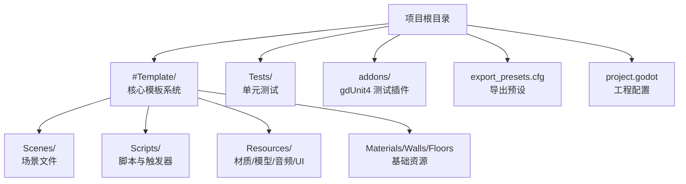
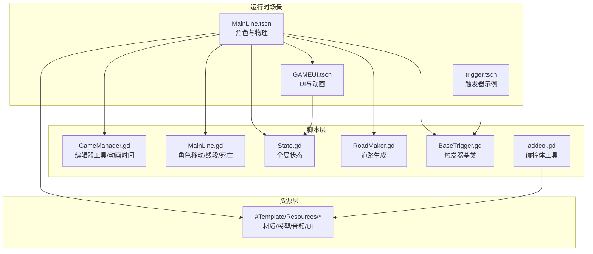
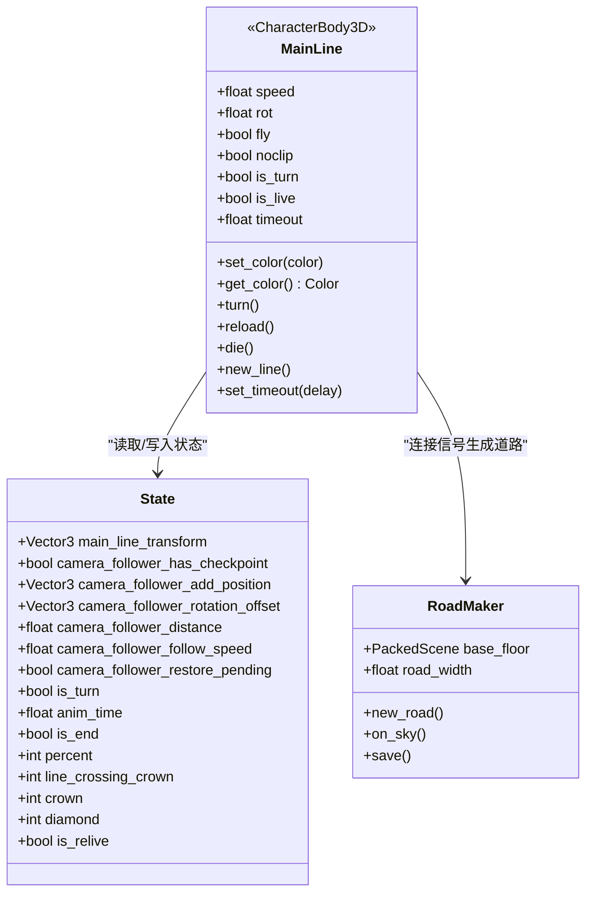
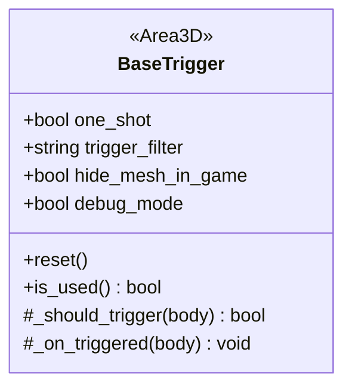
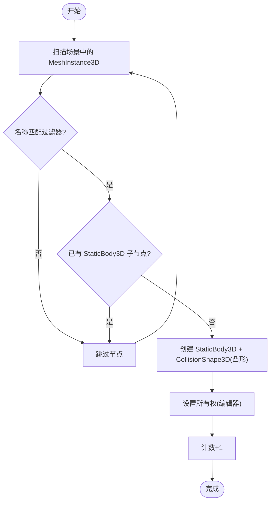
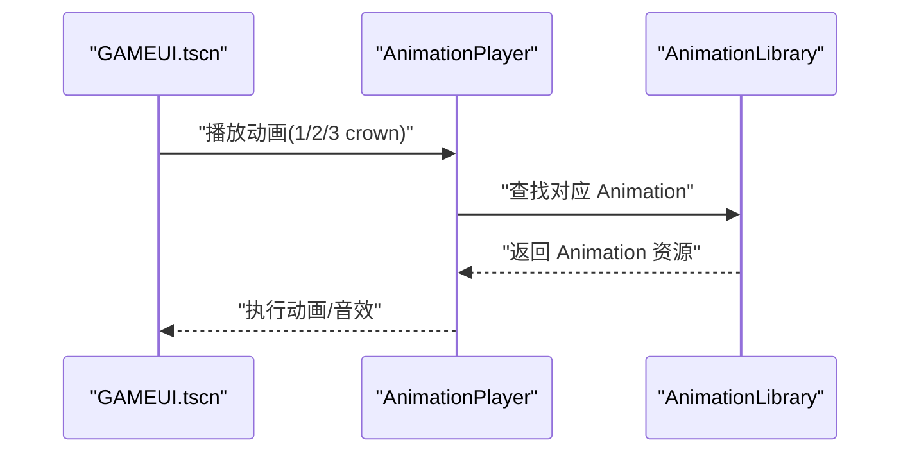
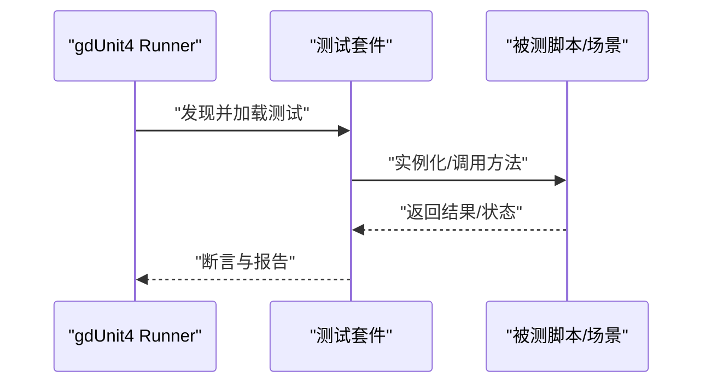
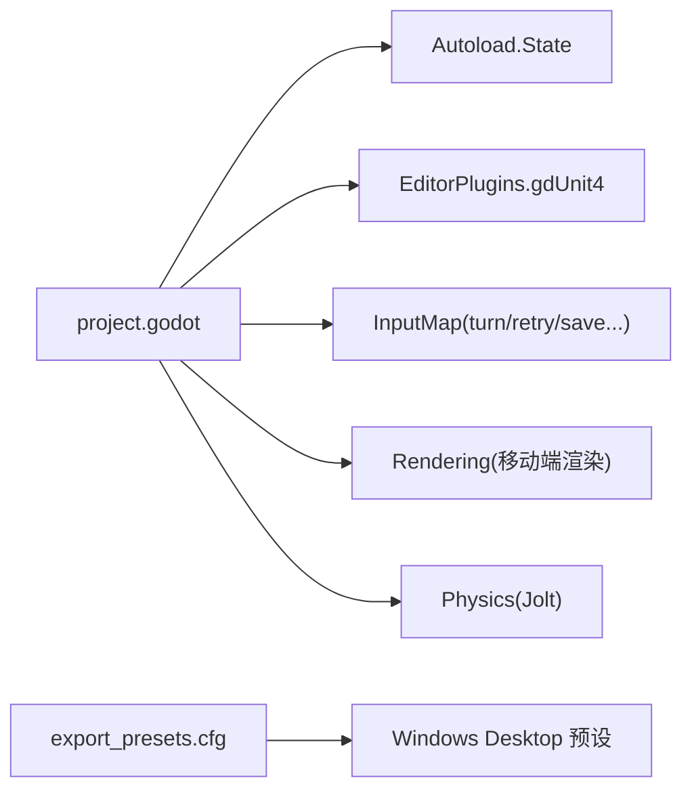

# 项目概述

<cite>
**本文引用的文件**   
- [README.md](file://README.md)
- [CONTRIBUTING.md](file://CONTRIBUTING.md)
- [project.godot](file://project.godot)
- [export_presets.cfg](file://export_presets.cfg)
- [GameManager.gd](file://#Template/[Scripts]/GameManager.gd)
- [MainLine.gd](file://#Template/[Scripts]/MainLine.gd)
- [State.gd](file://#Template/[Scripts]/State.gd)
- [RoadMaker.gd](file://#Template/[Scripts]/RoadMaker.gd)
- [BaseTrigger.gd](file://#Template/[Scripts]/Trigger/BaseTrigger.gd)
- [addcol.gd](file://#Template/[Scripts]/PortTookits/addcol.gd)
- [MainLine.tscn](file://#Template/MainLine.tscn)
- [GAMEUI.tscn](file://#Template/GAMEUI.tscn)
- [trigger.tscn](file://#Template/trigger.tscn)
- [MainLine_test.gd](file://Tests/MainLine_test.gd)
- [Crown_test.gd](file://Tests/Crown_test.gd)
</cite>

## 目录
1. [引言](#引言)
2. [项目结构](#项目结构)
3. [核心组件](#核心组件)
4. [架构总览](#架构总览)
5. [详细组件分析](#详细组件分析)
6. [依赖关系分析](#依赖关系分析)
7. [性能考量](#性能考量)
8. [故障排查指南](#故障排查指南)
9. [结论](#结论)
10. [附录](#附录)

## 引言
Godot Line 模板是一个基于 Godot Engine 4.6 的 Dancing Line 游戏模板框架，源自 ShinnLine 并与“冰焰模板 3/4”对齐，旨在降低学习成本并便于从冰焰模板迁移关卡，或直接发布至 ShinnLine 平台。项目强调高兼容性、模块化设计、测试驱动开发（gdUnit4），并提供跨平台支持（Windows/Linux/macOS）。对于初学者，它提供了开箱即用的完整模板系统；对于有经验的开发者，它提供了清晰的架构与可扩展的模块。

- 项目目标与定位：作为 Dancing Line 的模板，提供核心玩法实现、关卡生成与 UI 框架、触发器系统与工具集，支撑快速二次开发与发布。
- 技术特性：Godot 4.6 + GDScript、Jolt 物理、跨平台导出、测试驱动开发、模块化脚本与场景。
- 应用场景：独立游戏原型、移动端/桌面端发布、关卡编辑与迁移、教学与演示。

**章节来源**
- [README.md:1-137](file://README.md#L1-L137)

## 项目结构
项目采用“模板优先”的组织方式，核心模板位于 #Template/ 下，包含场景、脚本、资源与工具；测试位于 Tests/，插件位于 addons/（gdUnit4），导出配置位于 export_presets.cfg，工程配置位于 project.godot。

**图表来源**
- [project.godot:1-88](file://project.godot#L1-L88)
- [export_presets.cfg:1-75](file://export_presets.cfg#L1-L75)

**章节来源**
- [README.md:53-65](file://README.md#L53-L65)
- [project.godot:15-88](file://project.godot#L15-L88)

## 核心组件
- 主角色与运动系统：MainLine.gd 实现角色移动、转向、线段绘制、死亡粒子与特效。
- 状态管理：State.gd 提供全局状态（相机跟随、转向、动画时间、收集品计数等）。
- 关卡生成与道路：RoadMaker.gd 跟随角色动态生成道路网格。
- 游戏管理：GameManager.gd 提供编辑器工具按钮、动画起始时间计算、颜色设置等。
- 触发器基类：BaseTrigger.gd 提供统一触发逻辑、过滤器与一次性触发支持。
- 工具集：PortTookits/addcol.gd 提供网格碰撞体批量创建/移除工具。
- UI 与动画：GAMEUI.tscn 提供 UI 控件与动画库，配合 gdUnit4 测试验证。

**章节来源**
- [MainLine.gd:1-224](file://#Template/[Scripts]/MainLine.gd#L1-L224)
- [State.gd:1-21](file://#Template/[Scripts]/State.gd#L1-L21)
- [RoadMaker.gd:1-46](file://#Template/[Scripts]/RoadMaker.gd#L1-L46)
- [GameManager.gd:1-47](file://#Template/[Scripts]/GameManager.gd#L1-L47)
- [BaseTrigger.gd:1-102](file://#Template/[Scripts]/Trigger/BaseTrigger.gd#L1-L102)
- [addcol.gd:1-121](file://#Template/[Scripts]/PortTookits/addcol.gd#L1-L121)
- [GAMEUI.tscn:1-454](file://#Template/GAMEUI.tscn#L1-L454)

## 架构总览
整体架构围绕“场景-脚本-资源-测试”的模块化组织，核心运行时由 MainLine 场景承载，通过 State 管理全局状态，RoadMaker 动态生成道路，触发器系统提供关卡交互，UI 场景负责界面与动画，测试用例保障关键行为。

**图表来源**
- [MainLine.tscn:1-68](file://#Template/MainLine.tscn#L1-L68)
- [GAMEUI.tscn:1-454](file://#Template/GAMEUI.tscn#L1-L454)
- [trigger.tscn:1-24](file://#Template/trigger.tscn#L1-L24)
- [MainLine.gd:1-224](file://#Template/[Scripts]/MainLine.gd#L1-L224)
- [State.gd:1-21](file://#Template/[Scripts]/State.gd#L1-L21)
- [RoadMaker.gd:1-46](file://#Template/[Scripts]/RoadMaker.gd#L1-L46)
- [BaseTrigger.gd:1-102](file://#Template/[Scripts]/Trigger/BaseTrigger.gd#L1-L102)
- [GameManager.gd:1-47](file://#Template/[Scripts]/GameManager.gd#L1-L47)
- [addcol.gd:1-121](file://#Template/[Scripts]/PortTookits/addcol.gd#L1-L121)

## 详细组件分析

### 主角色与运动系统（MainLine）
- 职责：控制角色移动、转向、线段绘制、着陆特效、死亡与重生。
- 关键机制：物理帧处理、地面检测、线段生成与地面段同步、动画播放与时间对齐。
- 信号：new_line1/on_sky/onturn 用于驱动 UI 与相机跟随。
- 状态：is_live、is_turn、timeout、fly/noclip 等影响行为。

**图表来源**
- [MainLine.gd:1-224](file://#Template/[Scripts]/MainLine.gd#L1-L224)
- [State.gd:1-21](file://#Template/[Scripts]/State.gd#L1-L21)
- [RoadMaker.gd:1-46](file://#Template/[Scripts]/RoadMaker.gd#L1-L46)

**章节来源**
- [MainLine.gd:42-125](file://#Template/[Scripts]/MainLine.gd#L42-L125)
- [MainLine.gd:168-184](file://#Template/[Scripts]/MainLine.gd#L168-L184)
- [MainLine.gd:195-224](file://#Template/[Scripts]/MainLine.gd#L195-L224)

### 触发器系统（BaseTrigger）
- 职责：统一触发逻辑、过滤器、一次性触发与调试输出。
- 设计：子类仅需实现 _on_triggered(body)，即可获得标准化触发行为。
- 典型用途：加速、转向、收集品、音效/动画触发等。

**图表来源**
- [BaseTrigger.gd:1-102](file://#Template/[Scripts]/Trigger/BaseTrigger.gd#L1-L102)

**章节来源**
- [BaseTrigger.gd:29-98](file://#Template/[Scripts]/Trigger/BaseTrigger.gd#L29-L98)

### 工具集（PortTookits/addcol）
- 职责：为网格批量创建/移除静态碰撞体，支持名称过滤与层级设置。
- 适用场景：快速为场景中的 MeshInstance3D 添加凸形碰撞体，提升编辑效率。

**图表来源**
- [addcol.gd:20-81](file://#Template/[Scripts]/PortTookits/addcol.gd#L20-L81)

**章节来源**
- [addcol.gd:20-121](file://#Template/[Scripts]/PortTookits/addcol.gd#L20-L121)

### UI 与动画（GAMEUI）
- 职责：提供关卡标题、钻石计数、皇冠显示与动画库，支持按钮事件绑定。
- 动画：通过 AnimationPlayer 与 AnimationLibrary 管理不同数量的皇冠动画与音效。

**图表来源**
- [GAMEUI.tscn:17-323](file://#Template/GAMEUI.tscn#L17-L323)

**章节来源**
- [GAMEUI.tscn:445-454](file://#Template/GAMEUI.tscn#L445-L454)

### 测试驱动开发（gdUnit4）
- 职责：通过单元测试保障核心行为（MainLine、Crown 等）的正确性。
- 运行方式：命令行无头模式或编辑器内 gdUnit4 面板。
- 测试覆盖：属性断言、信号存在性、方法存在性、状态变化等。

**图表来源**
- [MainLine_test.gd:1-250](file://Tests/MainLine_test.gd#L1-L250)
- [Crown_test.gd:1-178](file://Tests/Crown_test.gd#L1-L178)

**章节来源**
- [README.md:67-87](file://README.md#L67-L87)
- [CONTRIBUTING.md:41-59](file://CONTRIBUTING.md#L41-L59)

## 依赖关系分析
- 引擎与插件：Godot 4.6（features=4.6）、Jolt 物理、gdUnit4 插件启用。
- 自动加载：State 作为全局单例节点自动加载。
- 输入映射：turn/retry/save/reload/savetaper 等输入事件绑定。
- 导出平台：Windows Desktop 预设，支持 x86_64 架构与纹理压缩等选项。

**图表来源**
- [project.godot:21-88](file://project.godot#L21-L88)
- [export_presets.cfg:1-75](file://export_presets.cfg#L1-L75)

**章节来源**
- [project.godot:15-88](file://project.godot#L15-L88)
- [export_presets.cfg:1-75](file://export_presets.cfg#L1-L75)

## 性能考量
- 物理与渲染：启用 Jolt 物理与移动端渲染策略，适合多平台性能平衡。
- 线段与道路：地面段线段数量与同步更新频率需根据场景规模调整，避免过度频繁的节点操作。
- 动画与特效：粒子与动画播放频率与曲线需权衡视觉与性能。
- 导出优化：开启纹理 VRAM 压缩与二进制格式优化，减少包体与加载时间。

[本节为通用指导，无需特定文件引用]

## 故障排查指南
- 测试运行失败：确认 gdUnit4 插件已启用，测试文件命名与继承规范符合要求。
- 输入无效：检查 project.godot 中输入映射是否正确，事件绑定是否生效。
- 物理异常：检查 Jolt 物理设置与碰撞形状，必要时使用 PortTookits/addcol 批量添加凸形碰撞体。
- 导出错误：核对 export_presets.cfg 的平台与架构设置，确保资源打包与脚本导出模式正确。

**章节来源**
- [project.godot:42-88](file://project.godot#L42-L88)
- [export_presets.cfg:25-75](file://export_presets.cfg#L25-L75)
- [CONTRIBUTING.md:41-59](file://CONTRIBUTING.md#L41-L59)

## 结论
Godot Line 模板以 Dancing Line 核心玩法为基础，结合 ShinnLine 与“冰焰模板 3/4”的对齐，提供高兼容性、模块化与测试驱动的完整框架。通过清晰的场景-脚本-资源组织与工具链支持，既能满足初学者快速上手，也能为有经验的开发者提供稳定的扩展空间。建议在二次开发中遵循模块化与测试先行的原则，充分利用 State 状态管理与触发器基类体系，确保功能稳定与可维护性。

[本节为总结性内容，无需特定文件引用]

## 附录
- 快速开始：克隆仓库、导入工程、运行主场景、输入控制说明。
- 贡献流程：Issue 分配、分支命名、测试要求、破坏性变更规范、代码规范。
- 许可证：MIT 开源协议。

**章节来源**
- [README.md:19-126](file://README.md#L19-L126)
- [CONTRIBUTING.md:1-106](file://CONTRIBUTING.md#L1-L106)